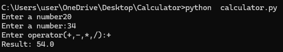

# Calculator Project

## Overview
A simple calculator application built using Python.

## Features
- Addition
- Subtraction
- Multiplication
- Division
- Error handling for division by zero
## Screenshot


## Technologies Used
- Python
- Git
- GitHub

## How to Run

1. Clone the repository
2. Open terminal in the project folder
3. Run:

```bash
python calculator.py
